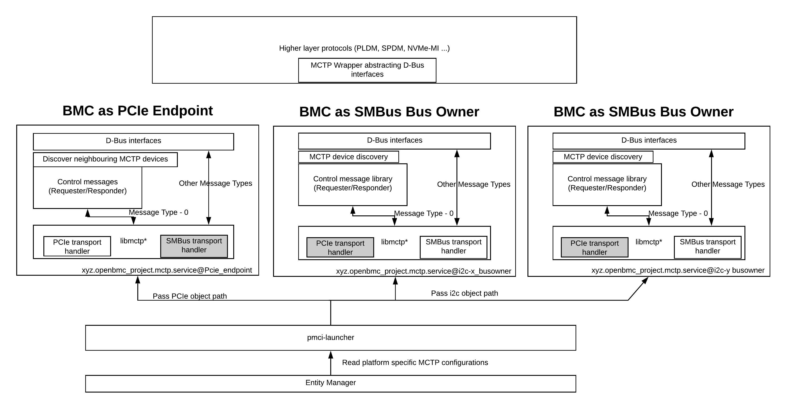

# PMCI protocol family

This repo aims to implement MCTP and PLDM protocols from the PMCI
specifications. This provides platform management functionality in the BMCs
managing the server platforms.

Management Component Transport Protocol (MCTP) provides a common transport
layer protocol for the application layer protocols providing platform
manageability solutions. The physical layer protocols like I2C, PCIe etc are
abstracted out of management protocols. MCTP specification also defines how
management controllers can be connected in a network and defines commands
for formation and maintainence of MCTP network.

PLDM defines data structures and commands that abstract platform management
subsystem components. PLDM supports a Type field to distinguish various types
of messages and group them together based on the functions(Ex: FRU,
Monitoring & Control, Firmware Update etc.)

## PMCI Specifications

[MCTP Base Specification](https://www.dmtf.org/sites/default/files/standards/documents/DSP0236_1.3.0.pdf)

[MCTP SMBus Binding Specification](https://www.dmtf.org/sites/default/files/standards/documents/DSP0237_1.1.0.pdf)

[MCTP PCIe Binding Specification](https://www.dmtf.org/sites/default/files/standards/documents/DSP0238_1.0.1.pdf)

[PLDM over MCTP binding Specification](https://www.dmtf.org/sites/default/files/standards/documents/DSP0241_1.0.0.pdf)

[PLDM Base Specification](https://www.dmtf.org/sites/default/files/standards/documents/DSP0240_1.0.0.pdf)

[PLDM IDs and Codes specification](https://www.dmtf.org/sites/default/files/standards/documents/DSP0245_1.3.0.pdf)

[PLDM Monitoring and Control Specification](https://www.dmtf.org/sites/default/files/standards/documents/DSP0248_1.2.0.pdf)

[PLDM State Set Specification](https://www.dmtf.org/sites/default/files/standards/documents/DSP0249_1.0.0.pdf)

[PLDM FRU Specification](https://www.dmtf.org/sites/default/files/standards/documents/DSP0257_1.0.0.pdf)

[PLDM Firmware Update Specification](https://www.dmtf.org/sites/default/files/standards/documents/DSP0267_1.0.1.pdf)

## PMCI component listing

|Sl No | PMCI recipe    | Feature Set                                                                                                                      |
|------| ---------------| ---------------------------------------------------------------------------------------------------------------------------------|
|1     | libmctp        | PCIe Binding, SMBus binding, MCTP Control messages                                                                               |
|2     | mctpd          | 1.Multiple MCTP daemon instances 2.Dynamic EID support3.Supports Bus Owner & Endpoint roles                                      |
|3     | libpldm        | PLDM Type 2, Type 4 and Type 5 (FWUP)                                                                                            |
|4     | pldmd          | BMC is PLDM requester; supports PLDM Sensors, FRU, Firmware Updates i.e. PLDM Type 0,2,4 and 5                                   |
|5     | pmci-launcher  | Provides platform portbalility of MCTP configurations                                                                            |
|6     | mctpwrapper    | C Wrapper library to abstract MCTP transport                                                                                     |
|7     | mctpwplus      | C++ Wrapper library to abstract MCTP transport                                                                                   |
|8     | mctp-emulator  | Enable upper layer protocol development without a real hardware                                                                  |

Note: Each of these components are organised in a separate directory, and
a README is added for each of these for more information.

## PMCI in OpenBMC project

Entity Manager advertises MCTP configurations specific to the platform.
This is used by pmci-launcher service, which starts multiple instances
of MCTP Service. The same service can be used to start upper layer protocols
(PLDM/SPDM etc.) based on the platform configurations.

The MCTP service instance can either start in Endpoint mode or in Bus Owner
mode. When the MCTP service instance comes up in endpoint mode, BMC comes up
with the special EID 0; the bus owner in that physical medium needs to
assign EID to BMC. When the MCTP service instance comes up in Bus Owner mode,
BMC discovers MCTP capable devices on the physical medium and assign EIDs
from a pre-configured EID pool (provided by Entity Manager).

MCTP Service will expose interfaces to enable upper layer protocols to
discover, send and receive the MCTP messages.

Note: In current architecture, MCTP Bridging is not supported. Each physical
bus forms a separate MCTP network.

Upper layer protocols can use mctpwplus library to interact with the MCTP layer.
The mctpwplus library provides the following:

1. Abstraction from IPC mechansim of the MCTP transport layer.

2. APIs to discover newly added/removed device in MCTP network.

3. APIs to send and receive MCTP payloads.

The current mctpwplus library works in conjuction with the IntelBMC mctp
implementation (i.e. using D-Bus), however the design goal is to incorporate
other implementations too (i.e. socket based MCTP transport).

A sample upper layer protocol like PLDM is represented in the figure above.
PLDM is transport layer agnostic and will be able to send out PLDM packets
over various MCTP bindings like SMBus, PCIe etc.

## Integrating the code

This particular repo depends on the following:

1. **libmctp** : This library provides the MCTP core functionality
(MCTP message assembly/dissassembly, binding specific TX and RX methods).This
can be picked up from Intel fork of libmctp: [Intel-BMC libmctp](https://github.com/Intel-BMC/libmctp)

This library supports the SMBus and PCIe bindings out of the box
(for Aspeed 26xx controllers). If you need custom bindings to be supported,
please feel free to add code for custom bindings.

2. **kernel drivers** : The libmctp in turn works with Kernel drivers.
For the SMBus binding, a custom driver called slave-mqueue and patches
for handling I2C muxes are required. The PCIe binding requires the driver that
controlls mctp-pcie controller (in AST26xx SoCs). The reference
implementation is available in: [Intel-BMC linux](https://github.com/Intel-BMC/linux)

3. **OpenBMC dependencies** : This repo aligns with concepts used in
OpenBMC project (D-Bus based IPC mechanisms, usage of boost library for async
operations, etc.). These dependencies are required for the code to build.

To integrate the features into your BMC, the following recipes can be
used as a reference in your Yocto build:
[PMCI recipes](https://github.com/Intel-BMC/openbmc/tree/intel/meta-openbmc-mods/meta-common/recipes-phosphor/pmci)

